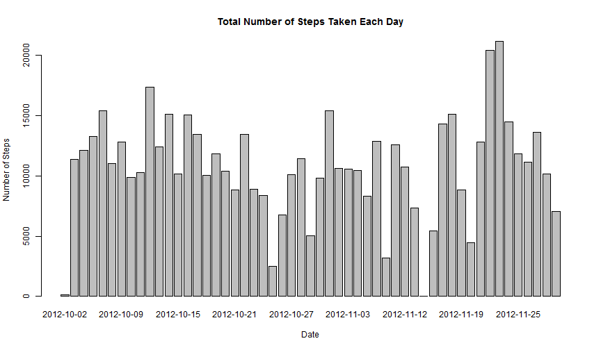
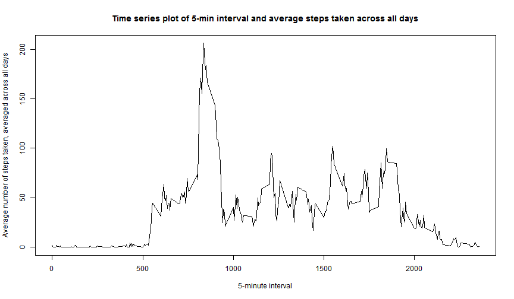
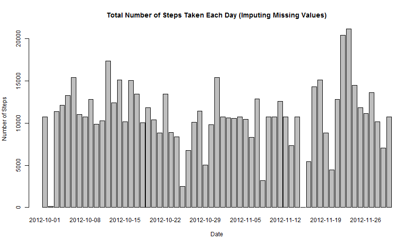
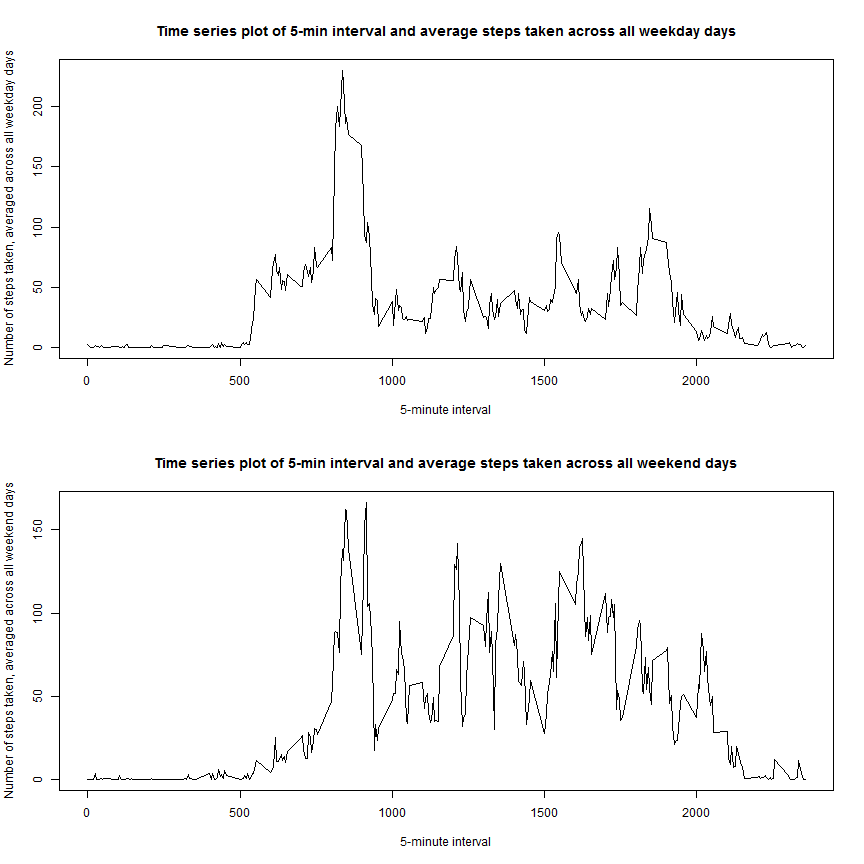

# Reproducible Research: Peer Assessment 1

------

## Introduction

This assignment makes use of data from a personal activity monitoring device. This device collects data at 5 minute intervals through out the day. The data consists of two months of data from an anonymous individual collected during the months of October and November, 2012 and include the number of steps taken in 5 minute intervals each day.  

------

## Data

The data for this assignment is included in this GitHub repository (**activity.zip**) and can also be downloaded from the course web
site:

* Dataset: [Activity monitoring data](https://d396qusza40orc.cloudfront.net/repdata%2Fdata%2Factivity.zip) [52K]

The variables included in this dataset are:

* **steps**: Number of steps taking in a 5-minute interval (missing values are coded as `NA`)

* **date**: The date on which the measurement was taken in YYYY-MM-DD format

* **interval**: Identifier for the 5-minute interval in which measurement was taken

The dataset is stored in a comma-separated-value (CSV) file and there are a total of 17,568 observations in this dataset.

------

## Loading and preprocessing the data


```r
unzip("activity.zip")
activity <- read.csv("activity.csv", )
```

------


## What is mean total number of steps taken per day?

#### Make a histogram of the total number of steps taken each day


```r
steps.date <- aggregate(steps ~ date, data=activity, FUN=sum)
barplot(steps.date$steps, names.arg=steps.date$date, 
        xlab="Date", 
        ylab="Number of Steps", 
        main = "Total Number of Steps Taken Each Day")
```

 

#### Calculate and report the **mean** and **median** total number of steps taken per day
   

```r
mean_daily_steps <- mean(steps.date$steps)
mean_daily_steps
```

```
## [1] 10766.19
```

```r
median_daily_steps <- median(steps.date$steps)
median_daily_steps
```

```
## [1] 10765
```

The **mean** total number of step taken per day is *10766* (rounded to nearest integer).

The **median** total number of step taken per day is *10765*.

------

## What is the average daily activity pattern?

#### Make a time series plot (i.e. `type = "l"`) of the 5-minute interval (x-axis) and the average number of steps taken, averaged across all days (y-axis)


```r
steps.interval <- aggregate(steps ~ interval, data=activity, FUN=mean)
plot(steps.interval, type="l",
     xlab="5-minute interval", 
     ylab="Average number of steps taken, averaged across all days", 
     main = "Time series plot of 5-min interval and average steps taken across all days")
```

 

#### Which 5-minute interval, on average across all the days in the dataset, contains the maximum number of steps?


```r
max_step_interval <- steps.interval$interval[which.max(steps.interval$steps)]
max_step_interval
```

```
## [1] 835
```

The 5-minute interval that contains the maximum number of steps is **835**.

------

## Imputing missing values

#### Calculate and report the total number of missing values in the dataset (i.e. the total number of rows with `NA`s)


```r
activity_nas <- sum(is.na(activity))
activity_nas
```

```
## [1] 2304
```

The total number of rows with `NA`s is **2304**.


#### Devise a strategy for filling in all of the missing values in the dataset. The strategy does not need to be sophisticated. For example, you could use the mean/median for that day, or the mean for that 5-minute interval, etc.

I will use the means for the 5-minute intervals to replace missing values.

#### Create a new dataset that is equal to the original dataset but with the missing data filled in.


```r
new_activity <- merge(activity, steps.interval, by="interval", suffixes=c("",".y"))
nas <- is.na(new_activity$steps)
new_activity$steps[nas] <- new_activity$steps.y[nas]
new_activity <- new_activity[,c(1:3)]
```

#### Make a histogram of the total number of steps taken each day and calculate and report the **mean** and **median** total number of steps taken per day. Do these values differ from the estimates from the first part of the assignment? What is the impact of imputing missing data on the estimates of the total daily number of steps?


```r
new_steps.date <- aggregate(steps ~ date, data=new_activity, FUN=sum)
barplot(new_steps.date$steps, names.arg=new_steps.date$date, 
        xlab="Date", 
        ylab="Number of Steps", 
        main = "Total Number of Steps Taken Each Day (Imputing Missing Values)")
```

 

```r
new_mean_daily_steps <- mean(new_steps.date$steps)
new_mean_daily_steps
```

```
## [1] 10766.19
```

```r
new_median_daily_steps <- median(new_steps.date$steps)
new_median_daily_steps
```

```
## [1] 10766.19
```

The **mean** total number of step taken per day is *10766* (rounded to nearest integer).

The **median** total number of step taken per day is *10766* (rounded to nearest integer).

The impact of the missing data seems negligible, at least when
estimating the total number of steps per day, using the means for the 5-minute intervals to replace missing values.

------

## Are there differences in activity patterns between weekdays and weekends?

#### Create a new factor variable in the dataset with two levels -- "weekday" and "weekend" indicating whether a given date is a weekday or weekend day.


```r
daytype <- function(date) {
    if (weekdays(as.Date(date)) %in% c("Saturday", "Sunday")) {
        "weekend"
    } else {
        "weekday"
    }
}
activity$daytype <- as.factor(sapply(activity$date, daytype))
```

#### Make a panel plot containing a time series plot (i.e. `type = "l"`) of the 5-minute interval (x-axis) and the average number of steps taken, averaged across all weekday days or weekend days (y-axis).


```r
par(mfrow=c(2,1))
for (type in c("weekday", "weekend")) {
    steps.type <- aggregate(steps ~ interval,
                            data=activity,
                            subset=activity$daytype==type,
                            FUN=mean)
    plot(steps.type, type="l", 
         xlab = "5-minute interval", 
         ylab = paste("Number of steps taken, averaged across all",type,"days"),
         main = paste("Time series plot of 5-min interval and average steps taken across all",type,"days"))
}
```

 

While activity patterns on weekdays is higher than weekends in the earlier part of the day (between 500th to 800th 5-minute intervals), activity patterns on weekends tend to be higher and more varied than weekdays (between 1000th to 2200th 5-minute intervals).
